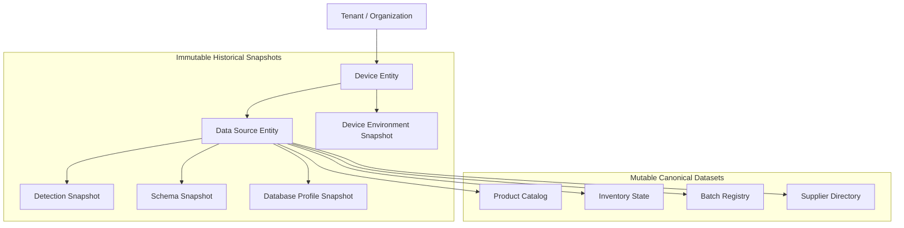

# PharmaTech Desktop Agent — Backend Contract Design
**Comprehensive Specification for Agent-to-Backend Data Contract**
*Document Version: 1.0.0 — Based on Verified Agent Pipeline*

---

## Executive Summary

The **PharmaTech Desktop Agent** has established a verified, deterministic, local data pipeline:
```text
Detection
  → Database Candidate Validation
  → SQLite Read-Only Connection
  → Schema Discovery
  → Database Profiling
  → Sample Extraction
  → Canonical Records (with Provenance)
```

This document specifies the **Backend Contract**: the exact interfaces, boundaries, data contracts, and serialization formats that a future Backend must accept. 

> [!IMPORTANT]
> **Design Rules**:
> 1. **Zero Backend Implementation in this Phase**: This document contains specifications, contracts, and schema definitions only. No backend source code or servers are created.
> 2. **Ground Truth**: Every contract is directly derived from the verified Rust domain models in `agent-core`, `agent-adapters`, and `agent-app`.
> 3. **Privacy by Design**: Clear boundary between internal machine-local diagnostics and cloud-admissible business data.

---

## 1. Canonical Data Inventory

The Desktop Agent produces structured data across 7 distinct stages. Below is the exhaustive inventory of all data models currently produced.

### 1.1 Device & Environment (`EnvironmentSnapshot`)
| Field | Type | Description | Local Source |
| :--- | :--- | :--- | :--- |
| `os_name` | `string` | Operating System name (e.g. "Windows 11 Pro") | Windows OS API |
| `os_version` | `string` | OS build / version string | Windows Registry / API |
| `architecture` | `string` | CPU architecture (e.g. "x86_64") | System environment |
| `hostname` | `string` | Local computer name | Environment variable |
| `username` | `string` | Active Windows user account | Environment variable |
| `common_paths_access` | `PathAccessInfo[]` | Standard paths accessibility (`path`, `exists`, `readable`) | Disk inspection |
| `privacy_level` | `enum` | `minimal`, `standard`, `full` | Agent configuration |
| `scan_timestamp` | `string` (RFC3339) | Scan execution time | System clock |
| `scan_status` | `string` | Execution outcome | Discovery engine |

---

### 1.2 Application Detection (`ApplicationDetectionCandidate`)
| Field | Type | Description |
| :--- | :--- | :--- |
| `id` | `string` | Normalized unique identifier (e.g. "pharmasoft") |
| `normalized_name` | `string` | Name stripped of architecture/version noise |
| `display_name` | `string` | Raw display name from Registry or process |
| `version` | `string \| null` | Detected version number |
| `publisher` | `string \| null` | Vendor / publisher name |
| `executable_path` | `string \| null` | Full path to the executable file on disk |
| `is_running` | `boolean` | Whether a process is actively running in memory |
| `evidence` | `ApplicationEvidence[]` | Supporting signals (`source`: `RunningProcess`, `InstalledProgram`, `RegistryEntry`, `ExecutablePath`, `WindowsService`, `details`: `string`) |
| `confidence_score` | `u32` (0–100) | Calculated confidence rating |
| `confidence_level` | `enum` | `High`, `Medium`, `Low` |
| `known_application` | `KnownApplicationMatch \| null` | Match from catalog (`known_app_id`, `canonical_name`, `matched_alias`, `vendor`, `category`) |
| `application_type` | `enum` | `BusinessApplication`, `SystemUtility` |

---

### 1.3 Database Candidate & Relationships (`DatabaseCandidate`, `ApplicationDatabaseRelationship`)
| Entity | Field | Type | Description |
| :--- | :--- | :--- | :--- |
| **Candidate** | `id` | `string` | Candidate ID (e.g. "file-PharmacyDB.db") |
| | `engine` | `enum` | `SQLite`, `SqlServer`, `PostgreSQL`, `MySQL`, `MariaDB`, `MicrosoftAccess`, `Firebird`, `Unknown(string)` |
| | `status` | `enum` | `Running`, `Stopped`, `Installed`, `FileFound` |
| | `location` | `string \| null` | File path or connection URI |
| | `evidence` | `DatabaseEvidence[]` | Supporting sources (`RunningProcess`, `WindowsService`, `InstalledProgram`, `DatabaseFile`, `ConfigurationFile`) |
| | `linked_application_id` | `string \| null` | ID of associated application if correlated |
| | `confidence_score` | `u32` | Confidence score (0–100) |
| | `confidence_level` | `enum` | `High`, `Medium`, `Low` |
| **Relationship** | `application_id` | `string` | Candidate application ID |
| | `database_id` | `string` | Candidate database ID |
| | `relationship_type` | `enum` | `DirectEvidence`, `StrongCorrelation`, `PathProximity`, `Unknown` |
| | `evidence` | `string[]` | Heuristic reasons for pairing |
| | `confidence_score` | `u32` | Correlation strength |

---

### 1.4 Candidate Validation & Connection (`CandidateValidationResult`, `ConnectionInfo`)
| Entity | Field | Type | Description |
| :--- | :--- | :--- | :--- |
| **Validation** | `candidate_id` | `string` | Validated candidate ID |
| | `status` | `enum` | `Valid`, `Invalid(reason)`, `Unsupported(reason)`, `NotValidated`, `RequiresConnectionDetails(reason)` |
| | `message` | `string` | Human-readable summary of validation outcome |
| | `checks` | `ValidationCheck[]` | Array of 5 checks (`name`, `passed`, `details`) |
| **Connection** | `candidate_id` | `string` | Candidate ID |
| | `status` | `string` | "Connected" or "Failed" |
| | `engine` | `string` | "SQLite" |
| | `path` | `string` | Target file path |
| | `is_read_only` | `boolean` | `true` (enforced via `SQLITE_OPEN_READ_ONLY`) |
| | `error` | `string \| null` | Error description if connection failed |

---

### 1.5 Discovered Schema (`SchemaSnapshot`)
| Level | Field | Type | Description |
| :--- | :--- | :--- | :--- |
| **Snapshot** | `tables` | `TableInfo[]` | List of all non-system tables |
| **Table** | `name` | `string` | Table name (e.g. "products") |
| | `columns` | `ColumnInfo[]` | Column definitions |
| | `primary_keys` | `string[]` | Primary key column names |
| | `foreign_keys` | `ForeignKeyInfo[]` | Relationships (`from_column`, `to_table`, `to_column`) |
| | `indexes` | `IndexInfo[]` | Indexes (`name`, `unique`, `columns`) |
| **Column** | `name` | `string` | Column name |
| | `data_type` | `string` | Declared SQLite type (`INTEGER`, `TEXT`, `REAL`, etc.) |
| | `is_primary_key` | `boolean` | Whether column is part of primary key |
| | `not_null` | `boolean` | Nullability constraint |

---

### 1.6 Database Profile (`DatabaseProfile`)
| Field | Type | Description |
| :--- | :--- | :--- |
| `classification` | `enum` | `PHARMACY`, `NON_PHARMACY`, `UNKNOWN` |
| `confidence_score` | `u32` (0–100) | Confidence rating based on matched domain entities |
| `confidence_level` | `string` | "High", "Medium", "Low" |
| `evidence` | `string[]` | Specific tables and columns matched (e.g. `prescriptions`, `generic_name`) |
| `reason` | `string` | Deterministic explanation text |

---

### 1.7 Canonical Data & Provenance (`CanonicalSnapshot`)
| Entity | Fields | Provenance Tracked? |
| :--- | :--- | :---: |
| **`Provenance`** | `source_path`: `string`, `source_table`: `string`, `source_id`: `string`, `extracted_at`: `string` (RFC3339) | — |
| **`ProductRecord`** | `id`: `string`, `name`: `string`, `barcode`: `string?`, `generic_name`: `string?`, `price`: `f64?` | **YES** |
| **`InventoryRecord`** | `id`: `string`, `product_id`: `string`, `quantity`: `i64`, `warehouse_or_location`: `string?` | **YES** |
| **`SupplierRecord`** | `id`: `string`, `name`: `string`, `phone_or_contact`: `string?` | **YES** |
| **`BatchRecord`** | `id`: `string`, `product_id`: `string`, `batch_number`: `string`, `expiry_date`: `string?`, `quantity`: `i64`, `purchase_price`: `f64?` | **YES** |

---

## 2. Local vs. Cloud Data Classification Matrix

To safeguard privacy and avoid leaking internal client infrastructure, local data must be strictly classified prior to transmission:

| Entity | Field | Produced Locally? | Sync to Cloud? | Classification | Reason / Transformation |
| :--- | :--- | :---: | :---: | :--- | :--- |
| **Device** | `os_name`, `os_version`, `architecture` | YES | **YES** | Public / Telemetry | Necessary for compatibility monitoring |
| | `hostname`, `username` | YES | **NO / MASKED** | PII / Host Security | Exposes employee name/network topography. Mask or omit. |
| | `common_paths_access` | YES | **NO** | Local Diagnostic | Internal disk accessibility only needed locally for debugging. |
| **App Detection** | `normalized_name`, `display_name` | YES | **YES** | Business Metadata | Identifies client ERP software |
| | `version`, `publisher` | YES | **YES** | Business Metadata | Helps backend map version-specific schema nuances |
| | `executable_path` | YES | **NO / OPAQUE** | Host Security | Contains local filesystem usernames/drives. Use opaque hash if needed. |
| | `evidence` (raw details) | YES | **NO** | Local Diagnostic | Verbose local OS registry/process evidence. |
| **Database** | `engine`, `status` | YES | **YES** | Business Metadata | Identifies database technology |
| | `location` (`source_path`) | YES | **NO / HASHED** | Host Security | Absolute disk paths (e.g. `C:\Users\Admin\...`) must be replaced with an opaque `data_source_id`. |
| **Validation** | `status`, `checks` | YES | **YES** (summary) | Operational Health | Informs backend if local connection is healthy without path details. |
| **Schema** | `tables`, `columns`, `PKs`, `FKs`, `indexes` | YES | **YES** | Technical Metadata | Essential for dynamic mapping validation and schema drift alerts. |
| **Profile** | `classification`, `confidence`, `reason` | YES | **YES** | Domain Classification | Determines whether data flows into Pharmacy or Retail aggregation. |
| **Canonical** | `ProductRecord` (name, barcode, generic, price) | YES | **YES** | Core Business Data | The primary business payload. |
| | `InventoryRecord` (product_id, qty, warehouse) | YES | **YES** | Core Business Data | Critical for stock level monitoring. |
| | `SupplierRecord` (name, contact) | YES | **YES** | Core Business Data | Supply chain association. |
| | `BatchRecord` (batch_no, expiry, qty, cost) | YES | **YES** | Core Business Data | Expiration management and inventory traceability. |
| | `Provenance.source_id` | YES | **YES** | Data Lineage | Identifies original record in source ERP for upsert/sync. |
| | `Provenance.source_table` | YES | **YES** | Data Lineage | Distinguishes entity origins. |
| | `Provenance.source_path` | YES | **NO / HASHED** | Host Security | Replaced with `data_source_id`. |
| | `Provenance.extracted_at` | YES | **YES** | Synchronization | Timestamp for resolving out-of-order updates. |

---

## 3. Backend Domain Boundaries

The Backend must organize the incoming data into clear conceptual boundaries:



### 3.1 Boundary Definitions

1. **Domain Entity** (Mutable, Stateful):
   - `Tenant` / `Organization`: The legal entity (Pharmacy, Pharmacy Chain, Distributor).
   - `Device`: The enrolled Desktop Agent installation.
   - `DataSource`: An identified ERP database instance on a device (identified by an opaque `data_source_id`).
   - `CanonicalEntity` (`Product`, `InventoryItem`, `Supplier`, `Batch`): Current state of truth in the central catalog.
2. **Snapshot** (Immutable, Versioned, Append-Only):
   - `SchemaSnapshot`: Exact structural definition at a point in time, identified by a cryptographic hash of tables + columns.
   - `ProfileSnapshot`: Classification outcome for a given `SchemaSnapshot`.
   - `DetectionSnapshot`: Discovery audit trail.
3. **DTO** (Wire Transfer Envelope):
   - Ingestion payloads transmitted over HTTPS.
4. **Provenance Metadata** (Audit & Deduplication):
   - Every canonical record carries origin coordinates (`tenant_id`, `device_id`, `data_source_id`, `source_table`, `source_id`, `extracted_at`).

---

## 4. Device Identity & Registration Contract

The Backend must treat each installed Desktop Agent as an identifiable client `Device`.

### 4.1 Device Conceptual Model
```text
Device {
    device_id: UUID (unique hardware/agent instance ID)
    tenant_id: UUID (associated Organization/Tenant)
    agent_version: string (e.g. "0.1.0")
    os_name: string
    os_version: string
    architecture: string
    status: Enum (PENDING_ENROLLMENT, ACTIVE, SUSPENDED, RETIRED)
    created_at: ISO8601 Timestamp
    last_seen_at: ISO8601 Timestamp
}
```

### 4.2 Device Heartbeat / Registration DTO
```json
{
  "device_id": "9b1deb4d-3b7d-4bad-9bdd-2b0d7b3dcb6d",
  "tenant_id": "c1a2b3c4-d5e6-7f8a-9b0c-1d2e3f4a5b6c",
  "agent_version": "0.1.0",
  "os_info": {
    "os_name": "Windows 11 Pro",
    "os_version": "10.0.22631",
    "architecture": "x86_64"
  },
  "timestamp": "2026-09-19T14:30:00.000Z"
}
```

---

## 5. Tenant & Multi-Organization Boundary

To ensure the Desktop Agent remains reusable across diverse deployment environments (Single Independent Pharmacy, Pharmacy Chain, Warehouse, Distributor/Supplier):

```text
               ┌──────────────────────────────┐
               │    Tenant / Organization     │
               │  (Role: Pharmacy / Supplier) │
               └──────────────┬───────────────┘
                              │ 1
                              │
                              │ *
               ┌──────────────┴───────────────┐
               │            Device            │
               │   (Desktop Agent Instance)   │
               └──────────────┬───────────────┘
                              │ 1
                              │
                              │ *
               ┌──────────────┴───────────────┐
               │         Data Source          │
               │ (ERP / SQLite / Future DBs)  │
               └──────────────────────────────┘
```

1. **Agnostic Agent**: The Desktop Agent does not contain hardcoded pharmacy or supplier tenant logic. It detects, profiles, and standardizes data.
2. **Dynamic Role Mapping**: The Backend uses the `DatabaseProfile` (`PHARMACY`, `NON_PHARMACY`) to route data into the proper tenant domain (e.g., Clinical Prescriptions vs. General Wholesale POS).

---

## 6. Ingestion Units & Mutation Semantics

Ingestion events must be decoupled into independent, cohesive payloads with defined mutability semantics:

| Ingestion Unit | Frequency | Mutability | Backend Handling |
| :--- | :--- | :--- | :--- |
| **`DeviceEnvironment`** | On startup / OS change | Replaced | Upsert device record; update `last_seen_at`. |
| **`DetectionSnapshot`** | On manual/scheduled scan | Append-only | Saved to audit log for diagnostic tracking. |
| **`SchemaSnapshot`** | On schema change detection | Immutable | Computed schema hash: if exists, reuse; if new, append new version. |
| **`ProfileSnapshot`** | Following schema discovery | Immutable | Stored alongside `SchemaSnapshot`. |
| **`CanonicalDataset`** | Incremental / Scheduled batch | Upsert | Upsert into tenant inventory/catalog using provenance deduplication keys. |

---

## 7. Canonical Data Wire Contract (JSON Schemas & DTOs)

### 7.1 Data Source Envelope
All canonical datasets are delivered inside a structured synchronization envelope:

```json
{
  "$schema": "http://json-schema.org/draft-07/schema#",
  "title": "IngestCanonicalPayload",
  "type": "object",
  "required": [
    "device_id",
    "data_source_id",
    "schema_fingerprint",
    "profile_classification",
    "dataset",
    "sync_timestamp"
  ],
  "properties": {
    "device_id": { "type": "string", "format": "uuid" },
    "data_source_id": { "type": "string" },
    "schema_fingerprint": { "type": "string" },
    "profile_classification": { "type": "string", "enum": ["PHARMACY", "NON_PHARMACY", "UNKNOWN"] },
    "sync_timestamp": { "type": "string", "format": "date-time" },
    "dataset": { "$ref": "#/definitions/CanonicalSnapshot" }
  },
  "definitions": {
    "Provenance": {
      "type": "object",
      "required": ["source_table", "source_id", "extracted_at"],
      "properties": {
        "source_table": { "type": "string" },
        "source_id": { "type": "string" },
        "extracted_at": { "type": "string", "format": "date-time" }
      }
    },
    "ProductRecord": {
      "type": "object",
      "required": ["id", "name", "provenance"],
      "properties": {
        "id": { "type": "string" },
        "name": { "type": "string" },
        "barcode": { "type": ["string", "null"] },
        "generic_name": { "type": ["string", "null"] },
        "price": { "type": ["number", "null"] },
        "provenance": { "$ref": "#/definitions/Provenance" }
      }
    },
    "BatchRecord": {
      "type": "object",
      "required": ["id", "product_id", "batch_number", "quantity", "provenance"],
      "properties": {
        "id": { "type": "string" },
        "product_id": { "type": "string" },
        "batch_number": { "type": "string" },
        "expiry_date": { "type": ["string", "null"] },
        "quantity": { "type": "integer" },
        "purchase_price": { "type": ["number", "null"] },
        "provenance": { "$ref": "#/definitions/Provenance" }
      }
    },
    "SupplierRecord": {
      "type": "object",
      "required": ["id", "name", "provenance"],
      "properties": {
        "id": { "type": "string" },
        "name": { "type": "string" },
        "phone_or_contact": { "type": ["string", "null"] },
        "provenance": { "$ref": "#/definitions/Provenance" }
      }
    },
    "InventoryRecord": {
      "type": "object",
      "required": ["id", "product_id", "quantity", "provenance"],
      "properties": {
        "id": { "type": "string" },
        "product_id": { "type": "string" },
        "quantity": { "type": "integer" },
        "warehouse_or_location": { "type": ["string", "null"] },
        "provenance": { "$ref": "#/definitions/Provenance" }
      }
    },
    "CanonicalSnapshot": {
      "type": "object",
      "required": ["products", "batches", "suppliers", "inventories"],
      "properties": {
        "products": { "type": "array", "items": { "$ref": "#/definitions/ProductRecord" } },
        "batches": { "type": "array", "items": { "$ref": "#/definitions/BatchRecord" } },
        "suppliers": { "type": "array", "items": { "$ref": "#/definitions/SupplierRecord" } },
        "inventories": { "type": "array", "items": { "$ref": "#/definitions/InventoryRecord" } },
        "extraction_summary": { "type": "string" }
      }
    }
  }
}
```

---

## 8. Idempotency, Deduplication & Upsert Rules

To prevent data corruption, duplicate records, or race conditions during network retries:

### 8.1 Primary Deduplication Keys (Natural Keys)
| Entity | Natural Key in Backend | Conflict Resolution |
| :--- | :--- | :--- |
| **`ProductRecord`** | `(tenant_id, data_source_id, provenance.source_table, provenance.source_id)` | Update `name`, `price`, `generic_name` if `extracted_at` > `existing.extracted_at`. |
| **Global Product Catalog** | `(tenant_id, barcode)` (where barcode is non-null) | Link multiple local source records to single catalog product. |
| **`BatchRecord`** | `(tenant_id, data_source_id, product_id, batch_number)` | Update `quantity`, `expiry_date` if `extracted_at` is newer. |
| **`SupplierRecord`** | `(tenant_id, data_source_id, provenance.source_id)` | Update `name`, `phone_or_contact`. |
| **`InventoryRecord`** | `(tenant_id, data_source_id, product_id, warehouse_or_location)` | Overwrite current stock balance with latest snapshot value. |

### 8.2 Idempotent Ingestion Header
Every sync request should carry an `X-Idempotency-Key` formed by:
```text
hash(device_id + data_source_id + sync_timestamp + records_count)
```
If the backend receives a duplicate key within a 24-hour window, it returns HTTP 200 with the cached response without re-processing.

---

## 9. Summary & Architecture Boundary Checklist

- [x] **No Backend code created** (Strictly contractual & architectural specification).
- [x] **Derived 100% from active Rust codebase** (`agent-core`, `agent-adapters`, `agent-app`).
- [x] **Complete inventory** of Device, Detection, Validation, Connection, Schema, Profiling, and Canonical models.
- [x] **Local vs. Cloud boundary** explicitly defined to prevent leaking machine filepaths or sensitive OS metadata.
- [x] **Clear Domain Entities vs. Snapshots vs. DTOs**.
- [x] **Device & Tenant decoupled** to support Pharmacy, Distributor, and Supplier roles.
- [x] **JSON Schema definitions** for all canonical records and ingestion envelopes.
- [x] **Idempotency & Deduplication keys** defined for reliable synchronization.
